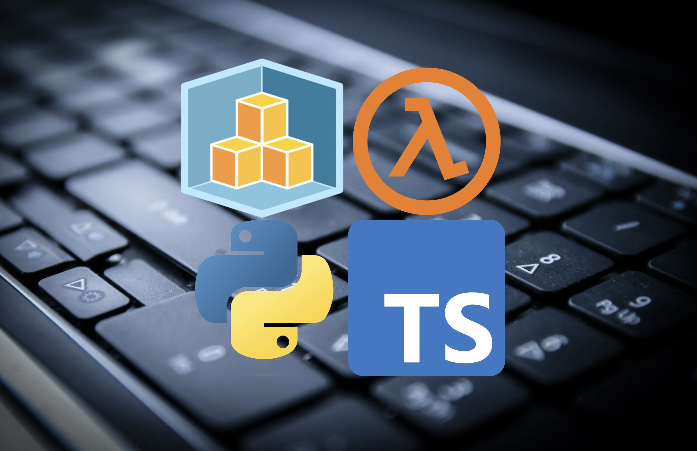

# CDK Python and TypeScript lambdas setup

The repo contains a working example of the configuration described at: [Three tutorials to boost your AWS CDK Python and TypeScript lambda development](https://medium.com/@_dani_salv/three-tutorials-to-boost-your-aws-cdk-python-and-typescript-lambda-development-7f0a27702656)

## How to use the project

This project is set up like a standard Python project.  The initialization process also creates
a virtualenv within this project, stored under the .venv directory.  To create the virtualenv
it assumes that there is a `python3` executable in your path with access to the `venv` package.
If for any reason the automatic creation of the virtualenv fails, you can create the virtualenv
manually once the init process completes.

To manually create a virtualenv on MacOS and Linux:

```
$ python3 -m venv .venv
```

After the init process completes and the virtualenv is created, you can use the following
step to activate your virtualenv.

```
$ source .venv/bin/activate
```

If you are a Windows platform, you would activate the virtualenv like this:

```
% .venv\Scripts\activate.bat
```

Once the virtualenv is activated, you can install the required dependencies.

```
$ pip install -r requirements.txt
```

At this point you can now synthesize the CloudFormation template for this code.

```
$ cdk synth
```

To add additional dependencies, for example other CDK libraries, just add to
your requirements.txt file and rerun the `pip install -r requirements.txt`
command.

## Useful commands

 * `cdk ls`          list all stacks in the app
 * `cdk synth`       emits the synthesized CloudFormation template
 * `cdk deploy`      deploy this stack to your default AWS account/region
 * `cdk diff`        compare deployed stack with current state
 * `cdk docs`        open CDK documentation

Enjoy!
